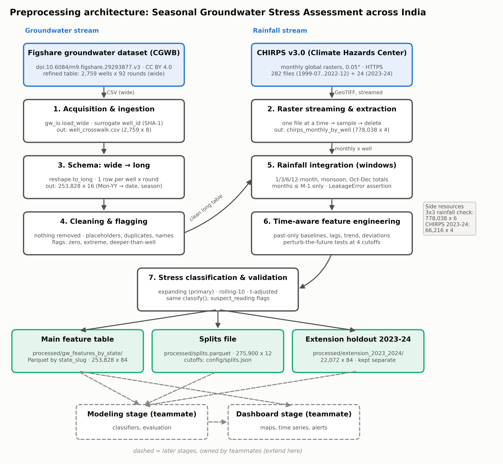

# System architecture: preprocessing portion

Files:
- `docs/architecture_preprocessing.png`: the diagram, drawn with matplotlib by
  `scripts/13_architecture.py`. The table shapes in its labels are read from the committed outputs.
- `docs/architecture_preprocessing.mmd`: the same graph as Mermaid source.

**Extending the diagram (modeling and dashboard teams):** the dashed boxes are placeholders for your
stages. Add your nodes and edges under the `HANDOFF` subgraph in the `.mmd` file, keeping the
existing node IDs unchanged. Either render it with any Mermaid tool, or add boxes to the `boxes`
dictionary in `scripts/13_architecture.py` and rerun it.

## The boxes

The diagram has two input streams, groundwater on the left and rainfall on the right. They join at
the rainfall integration step.

**Data sources.**
- *Groundwater:* the Figshare dataset "Quality controlled, reliable groundwater level data with
  corresponding specific yield over India" (doi:10.6084/m9.figshare.29293877.v3, CC BY 4.0), built
  from CGWB manual measurements. We use its refined 2000–2022 table: 2,759 wells × 92 rounds in wide
  layout, with the specific yield `Reference_Sy`. The authors' stage-4 table supplies the 2023–24
  extension rounds.
- *Rainfall:* CHIRPS v3.0 monthly global rasters from the Climate Hazards Center, at 0.05°
  resolution, downloaded over HTTPS. That is 282 files for 1999-07 to 2022-12, plus 24 for 2023–24.

**1. Acquisition and ingestion** (`gw_io.load_wide`, `scripts/02_reshape.py`). This step reads the
wide CSV unchanged. The original `Station Code` is corrupted by scientific-notation rounding, so it
assigns a surrogate `well_id` instead: a SHA-1 hash of state, district, station name, lat and lon.
- *In:* the refined CSV (2,759 × 113).
- *Out:* `dataset/well_crosswalk.csv` (2,759 × 8).

**2. Raster streaming and extraction** (`chirps.build_table`, `scripts/04a_chirps.py`). Files are
downloaded one at a time, sequentially, with polite retries. Each is sampled at every well's
nearest cell and then deleted at once, and the table is checkpointed after every month so the
download can resume.
- *Out:* `dataset/chirps/chirps_monthly_by_well.parquet` (778,038 × 4).
- *Side resources:* the 3×3 sampling-check table (778,038 × 6) and the 2023–24 extension
  (66,216 × 4).

**3. Schema standardisation: wide → long** (`reshape.to_long`). The table becomes one row per
well × round, and each `Mon-YY` label is parsed into date, year, month and season. Empty rounds are
kept as NaN.
- *Out:* `processed/interim/gw_long.parquet` (253,828 × 16).

**4. Cleaning and flagging** (`clean.clean`, `scripts/03_clean.py`). Nothing is removed. Placeholder
values become NaN, exact duplicates are dropped (there were none), and state and district names are
standardised. Flags are added for zero readings, robust extremes, negative values and readings
deeper than the well.
- *Out:* `processed/interim/gw_clean.parquet` (253,828 × 20).

**5. Rainfall integration** (`rainfall.rainfall_windows`, `features_extra.rainfall_extra`). This
step builds the 1/3/6/12-month windows, the last completed Jun–Sep and Oct–Dec totals, and
monsoon-year-to-date rainfall, all from months up to M−1. A `LeakageError` assertion runs on every
row.

**6. Time-aware feature engineering** (`features.build_features`, `features_extra.add_all`). This
step adds past-only seasonal baselines (expanding, rolling-10 and t-adjusted), groundwater lags and
history, a Theil-Sen trend, rainfall deviations from earlier-year normals, completeness and calendar
fields. Perturb-the-future tests run at four cutoffs.

**7. Stress classification and validation** (`stress.classify`, `validity.suspect_flags`,
`scripts/06_stress.py`). The same thresholds (1 / 1.5 / 2) apply to all three anomaly scores.
`stress_category` (expanding) is the primary label. The composite `suspect_reading` flag is added
here, and the contract tests validate dtypes, ranges and joins.

**Storage.**
- *Main feature table:* `processed/gw_features_by_state/`, Parquet partitioned by `state_slug` for
  leave-states-out work (253,828 × 84).
- *Splits file:* `processed/splits.parquet` (275,900 × 12), with cutoffs in `config/splits.json`.
- *Extension holdout:* `processed/extension_2023_2024/` (22,072 × 84), never mixed into the main
  table.

**Handoff (dashed boxes).** The modeling stage reads the main table and splits file, plus the
extension as a secondary check. The dashboard stage reads the main table and model outputs. Their
column contract is `docs/handoff_for_modeling.md`.
